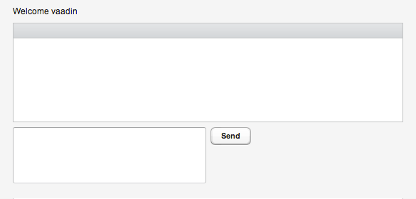
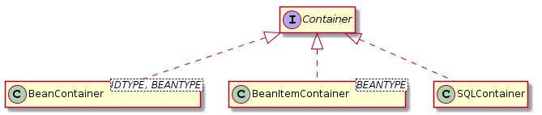
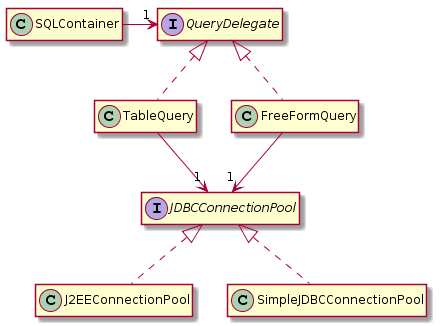

# Vaadin workshop


This Vaadin project intends to demonstrate some capabilities of the [Vaadin](https://vaadin.com/) web framework.

The material can be presented in different ways:

* As a full-fledged workshop
* As live-coding in front of an audience
* As a tutorial

## License and terms of use

The project is licensed under the terms of GPL v3, although if you use it - as you're encouraged to do, I would appreciate if you would:

* mention [this Github project](https://github.com/nfrankel/vaadin7-workshop/)
* give [me](http://blog.frankel.ch/me) credit in your slides
* ping me so that I know who uses it

Feedback and pull requests are also much appreciated!

## Prerequisites

There are only a few prerequisites to this workshop:

1. **Java**: the minim Java version Vaadin is compatible with is 6. However, version 8 provides lambda expressions.
2. **Maven**: this workshop provides a POM to retrieve dependencies and package the WAR
3. **Your IDE of choice**: get your favorite IDE, be it IntelliJ IDEA, Eclipse or Oracle NetBeans

## Going further

If you're interested to go further into Vaadin, I would suggest some of my personal resources:

* [morevaadin.com](http://morevaadin.com) contains a number of articles on a single dedicated subject
* [Learning Vaadin 7](http://www.packtpub.com/learning-vaadin-7-second-edition/book) is a whole book dedicated to learning Vaadin 7 from the ground up


## Demoed features

Features are presented in a step-by-step way. A tag demoes a specific feature (or a tight group thereof):

| Tag | Feature |
|-----|---------|
|[v7.2-1](https://github.com/nfrankel/vaadin7-workshop/tree/v7.2-1) | Starting point
|[v7.2-2](https://github.com/nfrankel/vaadin7-workshop/tree/v7.2-2) | Basic UI stuff
|[v7.2-3](https://github.com/nfrankel/vaadin7-workshop/tree/v7.2-3) | Architecture
|[v7.2-4](https://github.com/nfrankel/vaadin7-workshop/tree/v7.2-4) | More UI stuff
|[v7.2-5](https://github.com/nfrankel/vaadin7-workshop/tree/v7.2-5) | Tabular data
|[v7.2-6](https://github.com/nfrankel/vaadin7-workshop/tree/v7.2-6) | Push

If at any point, you're lagging behind in the workshop, you can easily get to the next step byt checking out the desired tag:

    git checkout v7.2-2

## Steps

### Step 1 - Starting off on the right foot

Vaadin provides a Maven archetype, which can be used with the following command-line:

```
mvn -B archetype:generate -DarchetypeGroupId=com.vaadin -DarchetypeArtifactId=vaadin-archetype-application -DarchetypeVersion=7.2.5 -DgroupId=ch.frankel.vaadin.workshop -DartifactId=vaadin-workshop -Dversion=1.0-SNAPSHOT -Dpackaging=war
```

This will generate a not-so-empty Vaadin application, with more than what is strictly necessary in this workshop. At this step, the project has been cleaned up to remove *widgetset*-specific code and POM configuration.

Now, let's get to work:

1. Create the WAR package with Maven:

```
mvn package
```

1. Look at the generated package
2. Deploy the WAR in a servlet container (*e.g.* Tomcat or Jetty)
3. Play with the application
4. Look at the raw source
5. Look at the generated HTML (with Chrome's Developer Tools or Firebug for Firefox)
6. Finally, look at the code
7. Try to put everything together

### Step 2 - UI Basics

#### Components

In the Vaadin framework, **components** can be added to the GUI to be displayed. Most of them are very similar to those in Swing (*e.g.* `TextField`, `PasswordField`, etc.). They are located under the `com.vaadin.ui` package.

* *Note 1*: some Vaadin components have no visual display, but this is the exception, not the rule.
* *Note 2*: most of Vaadin component constructors require a `String` argument. This is the label associated with the component.
* *Note 3*: `UI` is a container, not a layout - it can contain only a single child.

#### Layouts

**Containers** are specialized components that can have other components (including containers) as children. In turn, **layouts** are specialized containers that lay out their children in a specific way.

Try the following, be sure to check the display after each step:

1. Try adding a few components to the `VerticalLayout`
2. Change the `VerticalLayout` to a `HorizontalLayout`
3. Change the `HorizontalLayout` to a `FormLayout`

*Note*: it is possible to nest layouts inside layouts. However, as they translate as `div`, client computers may run into performance problems rendering too many nested levels.

In case of need, to debug layout issues, use the `debug=true` query parameter.

#### Margin, sizing and alignment

Though complete theming is available through Cascading Style Sheets, it's possible to use just Java to customize appearance. As previously, check the display after each code change:

1. There's no space between the window border and the password label. Use the `setMargin()` method on the layout.
2. Use the `setHeight()` or `setWidht()` on different components. Their parameter is a CSS size (*e.g* `50px` or `100%`). There's a shortcut method for `setHeight("100%")` and `setWidht("100%")` named `setSizeFull()`

*Note*: aligning components inside the layout is of course possible, but require references to the former and the later as well as defined sizes for each of them

#### Title

Check the page title in the browser: it is set to the page's location. Having a relevant title would go a long way toward a better user-experience. To achieve that, Vaadin provide the `@Title` annotation on the `UI`:


```java
@Title("Vaadin Workshop")
public class MyVaadinUI extends UI {
    ...
}
```

Alternatively, if the title is dynamic, setting the title can be achieved through the `Page` object.

```java
Page.getCurrent().setTitle("Vaadin Workshop");
```

*Note*: the static `getCurrent()` method is available on many Vaadin objects. It uses the `ThreadLocal` pattern, so that you don't have to pass references around.

### Step 3 - Architecturing

OOP is about componentization and reusability. At this point, we only have a single class with everything coded inside it, which defeats its purpose.

The following steps consist of architectural improvements, so make sure the displayed result should stay the same throughout of all them. 

#### Dedicated configuration class

Servlet 3.0 and associated annotations is a good way to replace the legacy `web.xml`, despite the overhead to subclass the `VaadinServlet` class. However, this doesn't mean the latter should be an inner class of the `UI`.

Extract the configuration servlet into its own class in the `ch.frankel.vaadin.workshop.web` package.

#### Reusable listeners

Java 8 allows to use lambda expressions in place of single method interfaces. Replace the `Button.ClickListener` with a lambda.

As a general rule, anonymous inner classes (or lambdas) should be avoided and top-level abstractions should be promote instead. Refactor the code to do this. Passing the layout reference as a constructor arguments is necessary (but please do not create accessors, think immutability). Put the newly created class into a dedicated `ch.frankel.vaadin.workshop.behavior` package and name it `DummyListener`. We'll create more useful listeners in this package later.

Also, move the `UI` class into a `ch.frankel.vaadin.workshop.ui` package.

#### Reusable GUI components

The `UI` represents the inner content of the browser window. To make parts of it reusable, they must be made top-level components.

Extract the `FormLayout` into its own dedicated class. This works but binds the component irremediably to the layout.

To make more configurable components, create components that extends `CustomComponent` and add a constructor that accepts a layout. In our case, name the component `LoginScreen` and the layout parameter should be of type `AbstractOrderedLayout`.

A `CustomComponent` is set its content either through its super constructor or through the `setCompositionRoot()` method.

```java
public class LoginScreen extends CustomComponent {

    public LoginScreen(AbstractOrderedLayout layout) {
        super(layout);
    }
}
```

Instantiate the `FormLayout` in the `UI` and pass it to the constructor.

```java
@Override
protected void init(VaadinRequest request) {
    setContent(new LoginScreen(new FormLayout()));
}
```

### Step 4 - More features

Vaadin brings unique and powerful features within your reach. This section is dedicated to a few of them.

#### Switching screens

Vaadin implements the Single Page Interface paradigm. 

An application which always displays the same components is not interesting. This section is dedicated to switch screens.

We will use a chat application mockup as an illustration. As the `LoginScreen` has already been developed previously, we just need a new screen `ChatScreen`. Create this component and for now, just add a simple label as the composition root to have something displayed.

Switching screens is achieved by using the `UI.getCurrent().setContent(...)`. Put it in a dedicated `LoginListener` and set this `LoginListener` as the button's new behavior. Don't implement anything for the login logic yet. Change the button's label accordingly (from "Click me!" to "Login"). Verify that when the button is clicked, the displayed screen changes.

```java
@Override
public void buttonClick(Button.ClickEvent event) {
    UI.getCurrent().setContent(new MainScreen());
}
```

Refresh the browser window (press F5): the display is reset to the first login screen. The reason is that the `init()` method of the `UI` is called. This is not so good when one has to develop screens that are set after a long sequence of screen changes. In order for the server state to be saved across browser refreshes, annotate the `UI` with `@PreserveOnRefresh`.

*Note*: to force `init()` to be called, add `restartApplication` to the query parameters

#### Notifications

Notifications are the Vaadin way to notify the user about events of interest happening. They are accessible through the `Notification` class. Use it to let the user he has been successfully logged in.

```java
Notification.show("You've been successfully logged in");
```

Simple notifications simply disappear when the user moves the mouse, which is not adapted to error. Implement a simple login logic in the listener and display an error notification when the user fails authentication: this is possible through the `Type.ERROR_MESSAGE` parameter in the `show()` method.

```java
Notification.show("Wrong credentials", ERROR_MESSAGE);
```

#### Storing data

Notice Vaadin cleverly hides the Java EE API, so that there's no straightforward access to many objects, such as `HttpSession`, `HttpServletRequest` and `HttpServletResponse` objects. This doesn't mean that their features are not accessible: in particular, storing data into the user session is provided via the `VaadinSession.getCurrent().setAttribute()` method. Store the login field value into the session and display it as a label on the main screen.

Attributes can be stored by key as usual, but also by class. This makes storing full-fledged objects such as `User` a breeze.

```java
VaadinSession.getCurrent().setAttribute(User.class, user);
```

### Step 5 - Tabular data

For a chat application, the `MainScreen` needs a few components:

* One `Grid` component to display sent messages
* One `TextArea` component to type messages
* One `Button` to effectively send messages

Use what you've learned previously to add those components to the screen as in the following mockup:



#### Frestyle model

Also, create a `Listener` to move the typed message from the message input to a row in the grid. This first requires configuring the grid to have a single column of type `String`.

```java
Grid grid = new Grid();
IndexedContainer container = new IndexedContainer();
container.addContainerProperty("Message", String.class, null);
grid.setContainerDataSource(container);
```

Vaadin provides an extremely rich structured model. In particular, there are 3 levels of abstraction available:

* `Property` to wrap a simple value (*e.g.* a date)
* `Item` to wrap objects - a collection of properties (*e.g.* a person)
* `Container` to wrap a collection objects

`Container` is naturally suited to be displayed in a grid component. Each `Item` in a container (*i.e.* row) is identified by a unique identifier dependent on the container's implementation.



For the moment, simply use the `Grid.addRow(Object... values)` method to add a new message.

```java
output.addRow(message);
```

Of course, using a grid to add a single piece of data is useless. Let's try to add more data:

* Author (*i.e.* the logged-in user)
* Date and time
* And keep the message, of course

#### Structured model

Using `IndexedContainer` to structure the container is not object oriented. Let's review possible options:

* `BeanContainer` has to provide a custom identifier generator
* In a `BeanItemContainer`, the `Item` itself is the identifier
* In a `SQLContainer`, the identifier is the *primary key* of the underlying database row

Leaving `SQLContainer` aside for now, choose the right `Container` implementation. Then, create a class to hold author, message and date.

Note that by adding structured types, **items are to be added on the container instead of the grid**. Vaadin out-of-the-box components that are set a data source register it so they will reflect changes to the underlying model.

```java
Message message = new Message(author, text, date);
container.addBean(message);
```

#### Customizing grids

Grid components can be heavily customized in a variety of ways.

* Headers

    * By default, column headers take the value of the underlying property. However, they can be customized via the `grid.getColumn(String).setHeaderCaption(String)`. Use it to change the column header captions.

    * The header row can also be hidden using the `grid.setHeaderVisible(false)` method.
    
* Columns

    * Columns can be hidden or ordered in a different way, using respectively `grid.getColumn(String).setHidden(boolean)` and `grid.setColumnOrder(String...)`. In the later case, note that container properties not listed in the var args parameter will be displayed on the grid.
    
    * As any components, columns can be set a width with `grid.getColumn(String).setWidth(int)`. The parameter is the width in pixels. Use this to resize the author and timestamp columns.
    
    * Column cells rendering can also be customized depending on the property type, this is based on renderers. Some renderers are available out of the box - `DateRenderer`, `ImageRenderer`, `HtmlRenderer`, etc., while you can implement your own using the `Renderer<T>` interface. By default, the property's value is formatted into a `String` using `toString()` and rendered in a `Label`.
    
        For example, use the existing `DateRenderer` to render the timestamp in a format of your choosing. Note that the format String is based on [`Formatter`](https://docs.oracle.com/javase/1.5.0/docs/api/java/util/Formatter.html), not `SimpleDateFormat` *e.g.*:
    
        ```java
        grid.getColumn("timeStamp").setRenderer(new DateRenderer("%1$ta. %1$tH:%1$tM:%1$tS"));
        ```
    
    * Even better, generated properties can be used to add columns that are not part of the model. To do so, the container has to be wrapped in a `GeneratedPropertyContainer` which offers a `addGeneratedProperty(String, PropertyValueGenerator<T>)`. For example, the following adds a new generated property to the grid:

        ```java
        GeneratedPropertyContainer genPropContainer = new GeneratedPropertyContainer(container);
        grid.setContainerDataSource(genPropContainer);
        genPropContainer.addGeneratedProperty("hello", new PropertyValueGenerator<String>() {
            @Override
            public String getValue(Item item, Object itemId, Object propertyId) {
                return "Hello World!";
            }
            @Override
            public Class<String> getType() {
                return String.class;
            }
        });
        ```
    
     Write such a generated property with a renderer to display a column with a "Delete me" button. Then add a behavior so that when the button is pressed, the associated row is removed from the container. Hint: the `ButtonRenderer` accepts a `RendererClickListener` as a constructor parameter.
    
Extract all grid-related code into its own decicated `MessageGrid` class.

#### SQL database

At this point, migrating to a SQL database instead of a in-memory container is straightforward: just change the `BeanItemContainer<Message>` type to a `SQLContainer` type.



Of course, some adaptations are in order:

1. The main changes has to be made in the `MessageGrid`. Replace the previous `BeanItemContainer` and along, replace `Message` property names by the names of the database columns (`TIME_STAMP`, `AUTHOR` and `TEXT`). Note some of the above objects have to be used, choose wisely!

    ```java
    JDBCConnectionPool connectionPool = ...
    QueryDelegate queryDelegate = ...
    Container container = new SQLContainer(queryDelegate);
    ```
    
    For connection parameters, use the available `Parameters` class.

2. In the click listener, replace usage of the `addRow()` method with the `addItem()` method and getting the desired property to set its value:

    ```java
    Object rowId = output.addItem();
    RowItem rowItem = (RowItem) output.getItem(rowId);
    rowItem.getItemProperty("DB_COLUMN").setValue(property);
    ```

3. By default, the SQL container doesn't commit changes automatically to the underlying database. Either set it auto-commit or commit each change (add and delete) explicitly.

Icing on the cake, the "add items" feature can be extracted from the listener to the grid, so as to promote encapsulation.

### Step 5 - Push

A messaging application with only one user is not really usable. This is however what happens with the current state of our app.

To fix it, we need messages sent from one client to be broadcasted to other logged in client. This translates into the code with a "Broadcaster" singleton that will take care of:

* Registering clients. At startup, each client will register itself to the broadcaster.
* Un-registering them. Clients **must** be made to unregister so as to prevent memory leaks.
* Broadcasting messages. Messages will be sent to all registered clients.

Vaadin doesn't offer such a class out-of-the-box but the Guava library provides an `EventBus` class. There's a `EventBusUtils` to provide a singleton instance available in the project.

Do the following:

1. Add the `@Push` annotation on the `UI` class.
1. Create a public getter around the grid in the main screen.
1. Call `grid.clearSortOrder()` to force refreshing the grid in the `UI.access()` method. Note: it has to be in the `UI` class itself, not from `UI.getCurrent()`.
1. In the `UI.init()` method, call `EventBusUtils.singleton().register(this)` to register the `UI` in the `EventBus` singleton.
1. In the `UI.detach()` method, call the opposite `EventBusUtils.singleton().unregister(this)`


