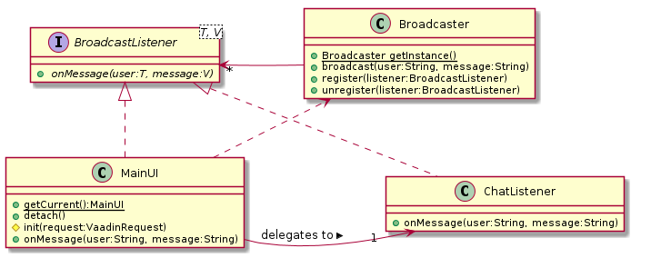

# Vaadin 7 workshop


This Vaadin 7 workshop intends to demonstrate some capabilities of Vaadin in general and Vaadin 7 in particular.

## License and terms of use
The project is licensed under the terms of GPL v3, although if you use it - as you're encouraged to do, I would appreciate if you would:

* mention [this Github project](https://github.com/nfrankel/vaadin7-workshop/)
* give [me](https://github.com/nfrankel) credit in your slides
* ping me so that I know who uses it

Feedback and contributions are also much appreciated!

## Demoed features

Features are presented in a step-by-step way. A tag demoes a specific feature (or a tight group thereof):

| Tag | Feature |
|-----|---------|
|[v0.0](https://github.com/nfrankel/vaadin7-workshop/tree/v0.0) | Project generated with Vaadin Maven archetype, but cleaned up to only provide what's necessary
|[v0.1](https://github.com/nfrankel/vaadin7-workshop/tree/v0.1) | Introduces components, layouts, title
|[v0.2](https://github.com/nfrankel/vaadin7-workshop/tree/v0.2) | Proposes an application architecture example, with reusable components
|[v0.3](https://github.com/nfrankel/vaadin7-workshop/tree/v0.3) | Introduces "screen" switch
|[v0.4](https://github.com/nfrankel/vaadin7-workshop/tree/v0.4) | Complete event listener model implementation
|[v0.5](https://github.com/nfrankel/vaadin7-workshop/tree/v0.5) | True push, broadcasted to all clients
|[v0.6](https://github.com/nfrankel/vaadin7-workshop/tree/v0.6) | Set displayed messages in a table instead in a text area

By checking out the desired tag, you can get the state of the project with just the desired state:

    git checkout tag v0.2

# Steps

## Step 0 - Starting off on the right foot

In order to start quickly, we use Maven and the provided artifact. On the command line, type

```
mvn -B archetype:generate  -DarchetypeGroupId=com.vaadin -DarchetypeArtifactId=vaadin-archetype-application -DarchetypeVersion=7.1.1 -DgroupId=ch.frankel.duchessswiss.vaadin -DartifactId=vaadin7-demo -Dversion=1.0-SNAPSHOT -Dpackaging=war
```

This creates a complete project, where some configuration parts are not needed. We may remove them with confidence:

1. In the POM:
    * Remove the `repositories` and `pluginRepositories` sections
	* Remove the commented out dependency
	* Remove the `vaadin-maven-plugin` plugin as it's used only when we need to compile GWT widgetsets
	* Remove the `lifecycle-mapping` plugin since it's only needed when the latter is used (and only in Eclipse)
1. In `MyVaadinUI.java`:
    * Remove `@Theme` as we will not use a custom theme
    * In `@VaadinServletConfiguration`, remove the `widgetset` attribute
1. Remove the `AppWidgetSet.gwt.xml` file (in `src/main/java`)
1. Remove the whole `src/main/webapp` folder

Both POM and UI should now be much more concise.

Now is the right time to deploy and play with our newly-created Vaadin application.

## Step 1 - UI proper

In this step, to check results of your updates, either:

* deploy to your local server inside your favorite IDE
* or wait until Tomcat reload classes and then refresh your browser

### Components

Adding components in Vaadin is a breeze if you're familiar with Swing or even plain <abbr title="Object-Oriented Programming">OOP</abbr>. Just add the wanted component to your layout, *e.g.* to add a text field, just use the following snippet:

```
TextField loginField = new TextField("Login");

layout.addComponent(loginField);
```

Now, try to add some more components on your own. Hint: they all implement `com.vaadin.ui.Component`.

Notice nearly most component constructors require a `String` argument; it will be displayed as their associated label on the UI.

### Layouts

As for components, layouts are pretty simple for Swing/Flex developers.

Layouts are dedicated components, that can contain other components(`com.vaadin.ui.Layout` extends `com.vaadin.ui.ComponentContainer` which in turn extends `com.vaadin.ui.Component` transitively) so it is very easy to nest layouts inside each other to provide for complex UIs. However, those translate as nested `div` tags in the rendered HTML: in real-life Vaadin applications, avoid nesting more than 3 levels of layouts as legacy browsers/machines will degrade performance poorly.

Change the `VerticalLayout` type to a `HorizontalLayout` type, then to a `FormLayout` and check results at each change. Let's settle on the form layout, as it offers the most pleasant display.

Note components can be set a determined height and width (`setHeight()` and `setWidth()`) while layouts add the following customizations:

* alignment of a component inside them

```
layout.setComponentAlignment(component, Alignment.MIDDLE_CENTER);
```

* an outer margin (akin to a CSS `margin`)
 
```
component.setMargin(true)
```
* an inner spacing (akin to a CSS `padding`)

```
component.setSpacing(true)
```
### Title

Change the displayed page title is as easy as adding a `@Title` annotation on the UI. For dynamic page title, use:

```
Page.getCurrent().setTitle(aDynamicallyComputedString);
```

## Step 2 - Architecturing

OOP is about componentization and reusability. At this point, we only have a single class with everything coded inside it, which defeats its purpose.

### Basics

At this point, clicking the button just adds a new static label. Instead of this label, try to display the login field value, to check we can get its value at any time. This requires adding the `final` attribute to the login field to be able to use in the anonymous inner class.

### Reusable listeners

As a general rule, we should avoid anonymous inner classes and promote instead top-level abstractions (at least until Java 8). Use your IDE specifics to achieve this: this means passing component references as arguments to the listener constructor (please do not create accessors, think immutability).

Also, put the newly-created class into a dedicated `ch.frankel.duchessswiss.vaadin.behavior` package and name it `DummyListener`.

### Reusable components

We should do the same for the GUI, assign separate responsibilities for UI and screen:

* The former manages the servlet and the title
* The latter is the reusable login screen component

Put this new `LoginScreen`class into a dedicated `ch.frankel.duchessswiss.vaadin.ui` package.
	
### UI name

Since we do not use a dedicated web deployment descriptor - a Servlet 3.0 feature, we can easily update our UI name: refactor `MyVaadinUI` to `MainUI` and check in its `@VaadinServletConfiguration` annotation, the `ui` attribute is updated accordingly.

Redeploy and check the output is the same.

## Step 3 - Switching UIs

We are now in the comfortable situation to be able to easily switch screens.

In order to create a chat application, let's create a new `ChatScreen` with the following components:

* one source `TextArea` to type messages
* one target `TextArea` to display messages
* and one `Button` to effectively send messages

Now, change the previous dummy behavior to a login behavior that set the `ChatScreen` as the UI's content:

```
UI.getCurrent().setContent(new ChatScreen());
```

### Session storage

Vaadin shields us from native Java EE API but provides similar features. In particular, instead of getting a handle on `javax.servlet.http.HttpSession` to store session data, Vaadin offers two ways:

* The standard hash map way, `VaadinSession.getCurrent().setAttribute(String, Object)`
* An improved storage access mechanism, `VaadinSession.getCurrent().setAttribute(Class<T>, Object)`. This of course is particularly appropriate when having a full-fledged class that should only have a single instance per "HTTP session" (*e.g.* a `Principal` or a user object).

Use this to store the login name after login has been processed, using one or the other way.

### Notification

In order to display messages to clients, Vaadin provides the `com.vaadin.ui.Notification` class instead of regular popups. Use it to inform login has been successful (or not).

Note that the modality - the user cannot interact with the UI behind an ERROR, comes for JavaScript and can easily be circumvented by disabling it: do not rely on that.

## Step 4 - Push

For a start, implement behavior so that messages written into the chat screen disappear from the input text area and are displayed into the main text area when the button is clicked using the event-listener model already used above.

This implementation is lacking, since it only displays messages to its own sender and not to other connected clients… not really useful in real-life.

### Broadcasted push

Broadcasted push means messages are pushed to every connected client. This requires several actions:

* Create a `BroadcastListener` class with an `onMessage()` method
* Create a `Broadcaster` singleton, that can register/unregister `BroadcastListener` instances
* The already existing `MainUI` should:
    * Implement `BroadcastListener`
	* Add a `BroadcastListener` attribute and a associated setter
	* Delegate UI changes to it inside the `onMessage()` method by using `access()`. The latter locks the UI so that changes may be handled in a thread-safe way.

```
    @Override
    public void onMessage(final Message message) {

        access(new Runnable() {

            @Override
            public void run() {

                broadcastListener.onMessage(message);
            }
        });
    }
```

Here's the summary class diagram:



## Step 5 - Tabular data

Messages display can be improved: a text area cannot be appended easily, so that we need to get its content, add the message and set the aggregated string again.

Vaadin provides a dedicated component to display tabular data - `com.vaadin.ui.Table`, and an underlying data model - `com.vaadin.data.util.BeanItemContainer`.

Set a new `BeanItemContainer` as a data source to the table.

Create a `Message` class, wrapping the sender login, sent time as well as the text. New messages can be added directly to the table data model, the table UI being a listener of its own data model (but changes still have to be pushed to all clients).

Table customization can be implemented in several ways:

* Order columns with `table.setVisibleColumns(String...)`
* By default, columns have the same width. Search how they can be set a width
* Hide column headers with `table.setColumnHeaderMode(ColumnHeaderMode.HIDDEN)`
* Column generators are a great way to either create new columns from data not found as-is in the data model or to customize existing columns. Provide a generated column to display time in a localized way. see the `Table.ColumnGenerator` and the `table.addGeneratedColumn(String)`.

The code should look something like this:

```
@Override
public Object generateCell(Table source, Object itemId, Object columnId) {

    // Get the item, i.e. the line. In our case, the message object
    Item item = source.getItem(itemId);

    // Get the column, i.e. the attribute. In our case, the date
    Property<Date> prop = item.getItemProperty(columnId);

    // Don't forget to do something with the returned object
    // As it is it doesn't change the output
    return prop.getValue();
}
```

Note that if the returned object implements `Component`, Vaadin will use it as-is while otherwise it will wrap it in a `Label` component.

# Going further

If at this point, you're interested to go further into Vaadin, I would suggest some of my personal resources:

* [morevaadin.com](http://morevaadin.com) contains a number of articles on a single dedicated subject
* [Learning Vaadin 7](http://www.packtpub.com/learning-vaadin-7-second-edition/book) is a whole book dedicated to learning Vaadin 7 from the ground up


    


[](https://bitdeli.com/free "Bitdeli Badge")

